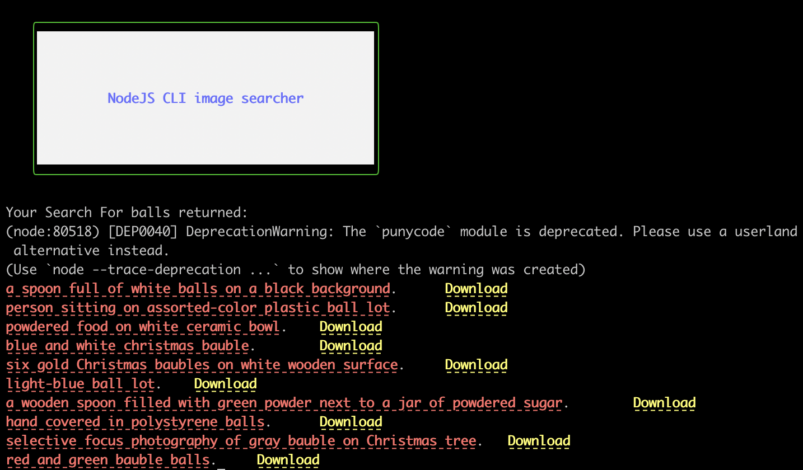
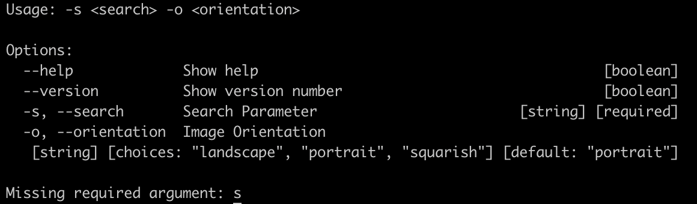

# NodeJS CLI image searcher
This is a simple JavaScript CLI tool that fetches images from Unsplash.

## Installation
- Clone the repository
```bash
git clone https://github.com/Zubs/node_cli.git
```

- Install the dependencies
```bash
npm install
```

- Create the .env file and add your secret keys
```bash
cp .env.example .env
```

- Run the application
To find images related to a search term, run the following command:
```bash
node bin/index.js -s <search term>
```

This returns a list of images related to the search term. Like this:


Running the command without the search term returns an error:


The returned images by default have the portrait orientation. To change the orientation, use the `-o` flag. The possible options are `landscape`, `portrait`, `squarish` For example:
```bash
node bin/index.js -s <search term> -o landscape
```
